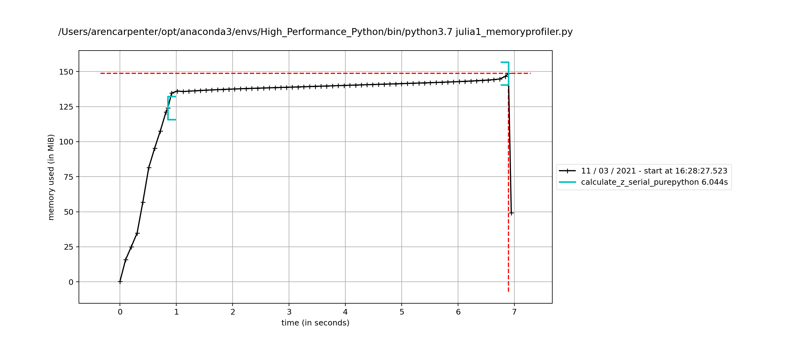

# High_Performance_Python

## Timing with cProfile

cProfile is a built-in profiling tool in the standard Python library. It introduces a greater overhead, but
it provides additional information on each aspect of your code and where the most time is being spent. 

```commandline
$ python -m cProfile -s cumulative julia1.py
```
```
Length of x: 1000
Total elements: 1000000
calculate_z_serial_purepythontook  9.52362608909607  seconds
         36221995 function calls in 10.267 seconds

   Ordered by: cumulative time

   ncalls  tottime  percall  cumtime  percall filename:lineno(function)
        1    0.000    0.000   10.267   10.267 {built-in method builtins.exec}
        1    0.032    0.032   10.267   10.267 julia1.py:1(<module>)
        1    0.573    0.573   10.234   10.234 julia1.py:9(calc_pure_python)
        1    7.369    7.369    9.524    9.524 julia1.py:43(calculate_z_serial_purepython)
 34219980    2.155    0.000    2.155    0.000 {built-in method builtins.abs}
  2002000    0.129    0.000    0.129    0.000 {method 'append' of 'list' objects}
        1    0.008    0.008    0.008    0.008 {built-in method builtins.sum}
        3    0.000    0.000    0.000    0.000 {built-in method builtins.print}
        4    0.000    0.000    0.000    0.000 {built-in method builtins.len}
        2    0.000    0.000    0.000    0.000 {built-in method time.time}
        1    0.000    0.000    0.000    0.000 {method 'disable' of '_lsprof.Profiler' objects}
```

Outside of the returned stats, we can generate a statistics file to be analyzed and visualized.

```commandline
$ python -m cProfile -o profile.stats julia1.py
```

This can be referenced in Python using the pstats library. 

```python
import pstats
p = pstats.Stats("profile.stats")
p.sort_stats("cumulative")
p.print_stats() # returns same message as above
```

## Line Profiling with KernProf line_profiler

Start by installing the library.
```commandline
conda install line_profiler
```

Then we can copy our julia1 script and replace the wrapper on our `calculate_z_serial_purepython`
function with `@profile`. This marks that function for line by line profiling with kernprof.

```commandline
kernprof -l -v julia1_lineprofiler.py
```

* `-l`: line-by-line profiling (instead of function profiling)
* `-v`: verbose output

```commandline
calculate_z_serial_purepythontook  71.19181418418884  seconds
Wrote profile results to julia1_lineprofiler.py.lprof
Timer unit: 1e-06 s

Total time: 41.5809 s
File: julia1_lineprofiler.py
Function: calculate_z_serial_purepython at line 55

Line #      Hits         Time  Per Hit   % Time  Line Contents
==============================================================
    55                                           @profile
    56                                           def calculate_z_serial_purepython(maxiter, zs, cs):
    57                                               """Calculate output list using Julia update rule"""
    58         1       2982.0   2982.0      0.0      output = [0] * len(zs)
    59   1000001     327470.0      0.3      0.8      for i in range(len(zs)):
    60   1000000     304128.0      0.3      0.7          n = 0
    61   1000000     361864.0      0.4      0.9          z = zs[i]
    62   1000000     339941.0      0.3      0.8          c = cs[i]
    63  34219980   15898113.0      0.5     38.2          while abs(z) < 2 and n < maxiter:
    64  33219980   12658413.0      0.4     30.4              z = z * z + c
    65  33219980   11338599.0      0.3     27.3              n += 1
    66   1000000     349394.0      0.3      0.8          output[i] = n
    67         1          0.0      0.0      0.0      return output
```
You can see that line-by-line profiling adds a significant overhead to the function. Run time increased to 
71 seconds using line profiling compared to 10 seconds with cProfile. However, we now have access to more 
information about what calls in our function are taking the most time.

What's causing this heavy resource usage in our function? We see that our `while` operation and comparisons
are slow, and because Python is dynamically typed, even simple `*` and `+` operations requires checking for
`__add__` methods to handle our data. 

One way of possibly speeding up the `while` statement is to swap the order of our multiple conditions because
Python evaluates conditionals left to right and opportunistically. This means that if the first statement 
fails, the second statement will not be evaluated. Thus one should put more frequently failing tests first. 
However, swapping these and rerunning the profiling shows only a modest gain in speed. 

## Memory Profiling with memory_profiler

There are many resources that we need to optimize in our code. In addition to speed, we need to be mindful of
memory usage. 

```commandline
conda install memory_profiler
```

Using the same `@profile` decorator as our line profiler, we can analyze our targeted function line-by-line
for its memory usage. 

```commandline
python -m memory_profiler julia1_memoryprofiler.py
```
We then get the following readout. Note that this process is more time intensive than the time profiling
and you can expect a much longer runtime. (It took my MacBook Pro with a QuadCore i5 and 16 GB RAM about an 
hour)

```commandline
Length of x: 1000
Total elements: 1000000
calculate_z_serial_purepythontook  3075.8688037395477  seconds
Filename: julia1_memoryprofiler.py

Line #    Mem usage    Increment  Occurences   Line Contents
============================================================
    55  124.297 MiB  124.297 MiB           1   @profile # uses memory_profiler to profile function by line
    56                                         def calculate_z_serial_purepython(maxiter, zs, cs):
    57                                             """Calculate output list using Julia update rule"""
    58  131.934 MiB    7.637 MiB           1       output = [0] * len(zs)
    59  148.902 MiB -19918.102 MiB     1000001       for i in range(len(zs)):
    60  148.902 MiB -19918.102 MiB     1000000           n = 0
    61  148.902 MiB -19910.730 MiB     1000000           z = zs[i]
    62  148.902 MiB -19910.395 MiB     1000000           c = cs[i]
    63  148.902 MiB -971121.309 MiB    34219980           while abs(z) < 2 and n < maxiter:
    64  148.902 MiB -951206.105 MiB    33219980               z = z * z + c
    65  148.902 MiB -951206.105 MiB    33219980               n += 1
    66  148.902 MiB -19918.102 MiB     1000000           output[i] = n
    67  148.902 MiB    0.000 MiB           1       return output
```
So we see that 7.6 MB was allocated for our output list on line 58.

We can also visualize the memory usage throughout the function running. 

```commandline
mprof run julia1_memoryprofiler.py

mprof plot mprofile_20210311162827.dat
```


